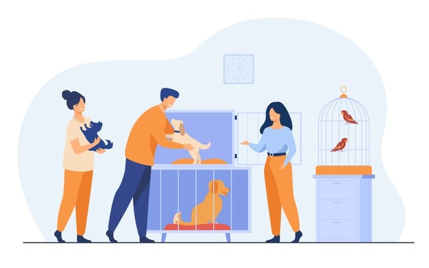

# _Animal Shelter API_        

#### By **Christina Welch** 
<br>



#### _An API that tracks Animals for an Animal Shelter_

<br>

## 💾 Technologies Used

* [C#](https://docs.microsoft.com/en-us/dotnet/csharp/)
* [ASP.NET Core MVC](https://docs.microsoft.com/en-us/aspnet/core/mvc/overview?view=aspnetcore-3.1)
* [MySQL 8.0.20](https://dev.mysql.com/)
* [Entity Framework Core](https://docs.microsoft.com/en-us/ef/core/)
* [Swagger](https://docs.microsoft.com/en-us/aspnet/core/tutorials/getting-started-with-nswag?view=aspnetcore-3.1&tabs=visual-studio)

<br>

## 🐶 Description

_End of week friday project for epicodus school made to demonstrate skills in creating an API. This API tracks Animals for an Animal Shelter. It uses Swagger to better show the api calls in a UI and Versioning to allow for new versions as the API is updated._

<br>

## 💻 Setup/Installation Requirements

### 🔧 Getting Started
### Install .NET Core
* On macOS Mojave or later
  * [Click here](https://dotnet.microsoft.com/download/thank-you/dotnet-sdk-2.2.106-macos-x64-installer) to download the .NET Core SDK from Microsoft Corp for macOS.
* On Windows 10 x64 or later
  * [Click here](https://dotnet.microsoft.com/download/thank-you/dotnet-sdk-2.2.203-windows-x64-installer) to download the 64-bit .NET Core SDK from Microsoft Corp for Windows.

### Install dotnet script
 Enter the command ``dotnet tool install -g dotnet-script`` in Terminal for macOS or PowerShell for Windows.

### Install VsCode(or a code editor of choice)
[Download VsCode here](https://www.npmjs.com/)

### Install MySQL Workbench (Optional)
To View and edit the database with a UI, Download and install the appropriate version of [MySQL Workbench](https://dev.mysql.com/downloads/workbench/)


### ⚙️ Setup and Use

* Clone this repository to your desktop
[Learn How](https://docs.github.com/en/repositories/creating-and-managing-repositories/cloning-a-repository)
* Open AnimalShelter.Solution/AnimalShelter in VScode or a code editor of your choice
* Create a new file and name it appsettings.json
* in the file add the following
```
{
  "Logging": {
    "LogLevel": {
      "Default": "Warning",
      "System": "Information",
      "Microsoft": "Information"
    }
  },
  "AllowedHosts": "*",
  "ConnectionStrings": {
    "DefaultConnection": "Server=localhost;Port=3306;database=animal_shelter;uid=root;pwd=[Your-Password-Here];"
  }
}
```
Note: make sure to replace [YOUR-PASSWORD-HERE] with your password for SQL.

* to change the port of the API go into Properties/launchSettings.json
```
...
      "applicationUrl": "https://localhost:5001;http://localhost:5000",
      // change your port here to whatever port you would like
...
```
* type dotnet ef database update into the terminal then type dotnet run

<br>

## API Endpoints

### GET Request
GET localhost:5000/api/animals
optional parameters
* species
* adoptable (Must be true or false in a string)
* gender
* name
example of using parameters:
GET localhost:5000/api/animals/?species="Cat"&adoptable="true"

### Get by ID
GET localhost:5000/api/animals/1
last number is the id number you want to find

### Post Request

Post http://localhost:5000/api/animals
include a body(in RAW JSON format)
{
  "name": "George",
  "species": "Cat",
  "breed": "Main Coon",
  "age": 7,
  "gender": "Male",
  "spayedOrNeutered": true,
  "availableForAdoption": true
}

### PUT Request

PUT http://localhost:5000/api/animals/1

{
  "animalId": 1,
  "name": "George",
  "species": "Cat",
  "breed": "Main Coon",
  "age": 8,
  "gender": "Male",
  "spayedOrNeutered": true,
  "availableForAdoption": true
}

### DELETE Request

DELETE http://localhost:5000/api/animals/1

<br>

## ❌ Known Bugs

the Swagger UI doesnt work well with versioning and may not show versions for methods correctly

## 📃 License

MIT License

Copyright (c) [2022] [Christina Welch]